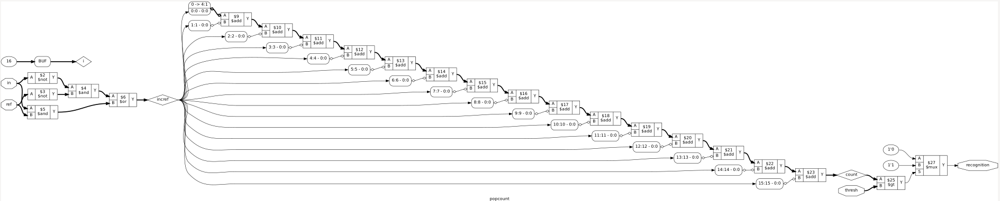

# 🔁 Gate-Level Cybernetic Classifier

  - A feedback-driven adaptive learning binary-classifier that based on error input autonomously alters its decision boundary by implementing [Max-Initialized Decremental Search](Detector_v1.1/Max-Initialized%20Decremental%20Search) (MIDS) and [State Aware Threshold Update](Detector_v1.1/State%20Aware%20Threshold%20Update) (SATU) and resetting the control loop for repeated adaptive cycles.

## 🐢 Max-Initialized Decremental Search - O(N)

  

   </b> 🤖 Adaptive learning system implementing MIDS algorithm

> The comparator output exhibited a static hazard due to unequal propagation delays on the threshold update signals. Since the edge-detection circuitry monitored transitions continuously, the transient pulse was interpreted as a legitimate boundary crossing. A hazard detection mechanism was therefore added to invalidate simultaneous activation of both edge detectors, preventing false convergence.

## ⚡State Aware Threshold Update - O(1)

  

  </b> 🤖 Adaptive learning system implementing SATU algorithm

## ⚙️ Implementation Stack

## 🛠️ Toolchain

## 📈 Planned Progression
- **Stage 0 (v0.x)**: Strict Boolean pattern relation analyzer. No learning, no noise tolerance, decision boundaries fixed by structural wiring.
- **Stage 1 (v1.0)**: Popcount based similarity and a variable threshold to alter the decision boundary. Introduces noise tolerance and ability to change the decision output without structural changes.
- **Stage 2 (v1.1)**: Cybernetic Feedback-driven adaptive learning. System alters its decision boundary based on external feedback to correct its decision output.
   - [MIDS Algorithm](Detector_v1.1/Max-Initialized%20Decremental%20Search)
   - [SATU Algorithm ](Detector_v1.1/State%20Aware%20Threshold%20Update) 

## 🧱 Versions Built
- **`Version 0`**: A pattern relation analyzer that classifies how an input pattern relates to a stored pattern, enforces rule based recognition rather than learning.
  - [Detector_v0.0](Detector_v0.0) -> Recognizes the exact pattern and sub-patterns if they are inside the boundary set up by weights-grid.
  - [Detector v0.1](Detector_v0.1) -> Recognizes the exact pattern and super-patterns if they are outside the boundary set up by weights-grid.
  - [Detector v0.2](Detector_v0.2) -> Classifies the input as a sub-pattern, super-pattern, anti-pattern or equivalence precisely through a 2-POV logical analysis.

- **`Version 1`**: Pop-count based judgement against a variable Threshold instead of perfect equivalence check and cybernetic feedback-driven adaptive learning. 
  - [Detector_v1.0](Detector_v1.0) -> Recognizes the pattern if total number of matched pixels are greater than the set threshold which can vary giving us ability to control the decision output.
  - [Detector_v1.1](Detector_v1.1) -> A feedback-driven adaptive system that autonomously adjusts its decision boundary to correct its output, using algorithms optimized for hardware constraints.
  

  

  </b> 🧩 Block Diagram - Detector_v1.0 (Manually Alterable Decision Boundary)

## 🧠 Adaptive Learning Algorithms 
- [Max-Initialized Decremental Search (MIDS)](Detector_v1.1/Max-Initialized%20Decremental%20Search)
- [State Aware Threshold Update (SATU)](Detector_v1.1/State%20Aware%20Threshold%20Update)

| Property | MIDS | SATU |
|---|---|---|
| Correction Speed | O(N) | O(1) |
| State Awareness | None | Current & desired output |
| Correction Strategy | Iterative threshold traversal | Direct threshold computation |
| Direction | Starts from maximum threshold and decrements | Computes `T = M−1` or `T = M` directly |
| Threshold Storage | Requires threshold memory | No threshold memory required |
| Traversal Logic | Required | Not required |
| Synchronization | Multiple synchronization requirements | Single synchronizer |
| Control Hardware | Large control loop coordinating traversal | Simpler control path |
| Initialization | Requires programmed threshold memory and correct setup sequence | Start the system and provide the required inputs |
| Hardware Complexity | Higher | Lower |
| External Setup Complexity | Higher | Very low |
| Guaranteed Convergence | Yes, for M ∈ {1,...,15} | Yes, for M ∈ {1,...,15} |
| Algorithmic Principle | Search for the boundary | Compute the boundary |

### 🎯 Convergence Proofs
- [MIDS Convergence Proof](https://github.com/KARAN-D05/Gate-Level-Cybernetic-Classifier/tree/main/Detector_v1.1/Max-Initialized%20Decremental%20Search#-convergence-proof)
- [SATU Convergence Proof](https://github.com/KARAN-D05/Gate-Level-Cybernetic-Classifier/tree/main/Detector_v1.1/State%20Aware%20Threshold%20Update#-convergence-proof)

  

   </b> ⏱️ Correction Speed Complexity Comparison

## 💻 Verilog Implementation

### 🎯 Strict Boolean Matching
- [Detector_v0.0](Detector_v0.0/Verilog-Implementation)

    
     </b> 
 Equivalence & Sub-Pattern Recognition 🔹 

- [Detector_v0.1](Detector_v0.1/Verilog-Implementation)

    
    </b> 
 Equivalence & Super-Pattern Recognition 🟦 

- [Detector_v0.2](Detector_v0.2/Verilog-Implementation)

    
   </b> 
 Equivalence & Super & Sub & Anti-Pattern Recognition 🔹🟦 

### 🔄 Popcount-Based Adaptive Learning

- [Detector_v1.0](Detector_v1.0/Verilog-Implementation)

    
    </b> 
 Manually Alterable Decision Boundary ⚖️ 

- [Detector_v1.1](Detector_v1.1/Max-Initialized%20Decremental%20Search/Verilog)
  

    
    </b> 
 🤖 Automatic Decision Boundary Alteration - MIDS 

- [Detector_v1.1](Detector_v1.1/State%20Aware%20Threshold%20Update/Verilog)
  

    
    </b> 
 🤖 Automatic Decision Boundary Alteration - SATU 

## 🔬 RTL Synthesis, Timing and Power Analysis

To verify hardware realizability, all detector variants were synthesized using **Yosys**, technology mapped to the **Sky130HD standard-cell library**, and analyzed using **static timing** and **power estimation**. The resulting gate-level netlists were used to compare architectural complexity, silicon area, timing characteristics, power consumption, and estimated operating frequency across the evolution of the Cybernetic Classifier.

> Technology: Sky130HD

### 📊 Implementation Metrics Comparison 

| Version       | Module                    |              Area | Critical Path Delay |       Power |                                                             
| ------------- | ------------------------- | ---------------- | ------------------ | ---------- | 
| Detector v0.0 | **Eq/Sub Recognizer**     |      127.6224 µm² |             0.46 ns |     30.8 µW |
| Detector v0.1 | **Eq/Super Recognizer**   |      127.6224 µm² |             0.46 ns |     30.8 µW | 
| Detector v0.2 | **Multi-POV Classifier**  |      230.2208 µm² |             1.16 ns |     60.6 µW | 
| Detector v1.0 | **Pop-Count Recognition** |      970.9312 µm² |             4.58 ns |      599 µW | 
| MIDS      | **MIDS**                  |  1244.944 µm² |         1.76 ns |  833 µW | 
| SATU     | **SATU**                  | 1178.6304 µm² |         2.09 ns | 1.10 mW |

### 🏆 Implementation Highlights

| Category                | Result                                     |
| ----------------------- | ------------------------------------------ |
| Smallest Design         | Eq/Sub & Eq/Super Recognizers (127.62 µm²) |
| Largest Design          | MIDS (1244.94 µm²)                   |
| Fastest Design          | Eq/Sub & Eq/Super (0.46 ns)                |
| Slowest Design          | Pop-Count Recognition (4.58 ns)            |
| Lowest Power            | Eq/Sub & Eq/Super (30.8 µW)                |
| Highest Power           | SATU (1.10 mW)                        |
| Fastest Adaptive Design | MIDS (1.76 ns)                         |
| MIDS Timing Slack       | 8.11 ns @ 10 ns clock                      |
| SATU Timing Slack       | 7.79 ns @ 10 ns clock                      |
| MIDS Fmax              | ≈568 MHz                                   |
| SATU Fmax             | ≈478 MHz                                   |
| Most Arithmetic-Heavy   | Pop-Count Recognition (15 Adders)          |
| Most Decision-Heavy     | Multi-POV Classifier (11 MUXes)           |
| Largest Cell Count      | Multi-POV Classifier (28 cells)            |

    
    </b> 
 Detector_v1.0 Synthesized - Yosys ✅ 

## 📜License
- Source code and HDL files are licensed under the MIT License.
- Documentation, diagrams, images, and PDFs are licensed under Creative Commons Attribution 4.0 (CC BY 4.0).
